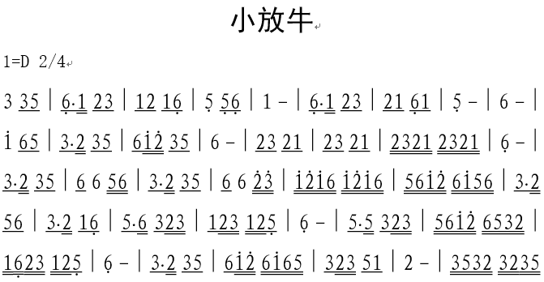

# 录入简谱&&转五线谱的快速直观的方法

## Step1：在Word中安装新的字体
DiziFont.ttf是使用开源的字体制作软件FontForge所编写的字体，最初是用于笛子谱的录入，但是它也适用于一般简谱的录入。

将DiziFont.ttf下载至本地后，将它在Word中进行安装，就可以和Word中普通的字体（宋体，黑体...）一样使用啦。
## Step2：在Word中进行简谱录入
开始进行简谱的录入。首先，第一行为乐曲标题，第二行为调号和节拍。然后，在Word中将字体调至DiziFont，并使用如下的规则进行具体音符的录入：

- 1 2 3 4 5 6 7：基本音符
- 8：高音
- *：低音
- z：八分音符
- x：十六分音符
- c：三十二分音符
- b：十六分音符低音
- n：三十二分音符低音
- \：小节线

一个示例如下所示：

## （可选）Step3：将简谱现实的Word文档转成MusicXML格式

使用Word2XML.ipynb可将Word文档转换成MusicXML文件。编程思路后续更新，主要涉及到分词、互斥锁等计算机相关知识及部分基础乐理知识。

## （可选）Step4：在MuseScore中打开MusicXML格式文件

在MuseScore中可对MusixXML格式文件进行五线谱式的显示，一个例子如下：

### 环境
- Windows系统
- Microsoft Word
- Python 3
    - Music21
    - Docx